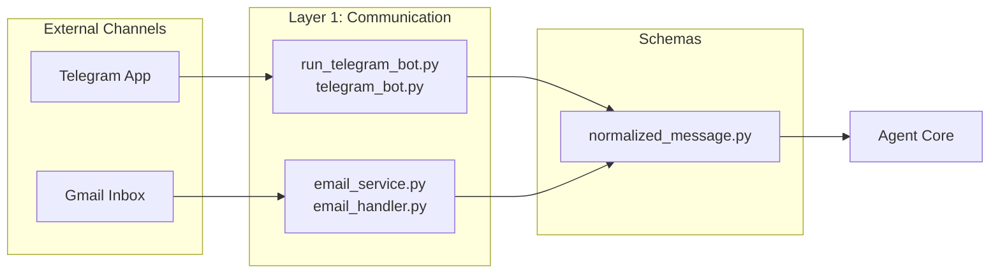
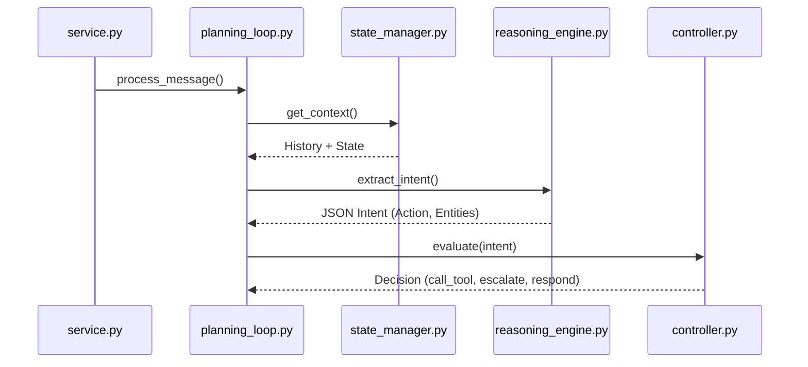
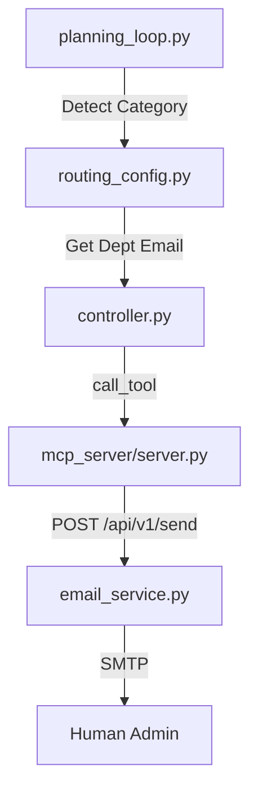

# CIF-AI: Detailed System Architecture & Flows

This document provide a file-by-file breakdown of how information flows through the CIF-AI platform, from user message to agent response and escalation.

---

## 1. Message Ingestion Flow (Layer 1)
This flow handles receiving messages from external channels (Telegram, Email) and normalizing them for the brain.

### Telegram Flow
1.  **Entry Point**: `run_telegram_bot.py` starts the bot.
2.  **Logic**: `communication/telegram_bot.py` uses `python-telegram-bot` to poll for messages.
3.  **Normalization**: It packages the message into the `NormalizedMessage` schema defined in `communication/schemas/normalized_message.py`.
4.  **Forwarding**: It POSTs the JSON payload to the `agent-core` service.

### Email Flow
1.  **Entry Point**: `communication/email_service.py` starts the FastAPI service.
2.  **Auth**: `communication/email_handler.py` handles Gmail OAuth via `credentials.json` and `token.json` (stored in `secrets/`).
3.  **Polling**: The service polls Gmail, decodes the body, and normalizes it.
4.  **Forwarding**: It POSTs the payload to the `agent-core` service.

---

## 2. Reasoning & Planning Flow (Layer 2)
This is the "Brain" of the system where decisions are made.

1.  **API Entry**: `agent_core/service.py` receives the `NormalizedMessage`.
2.  **Orchestration**: It hands the message to `agent_core/planning_loop.py`.
3.  **Memory Retrieval**: `planning_loop.py` uses `agent_core/state_manager.py` which calls `shared/data_access/conversation_repository.py` to fetch history from Supabase (via `shared/data_access/db_client.py`).
4.  **Intent Extraction**: `agent_core/reasoning_engine.py` sends the message + history to **Groq** (using `openai/gpt-oss-120b`).
5.  **Policy & Decision**: The extracted intent is passed to `agent_core/controller.py`.
    - It checks rules in `agent_core/policy_engine.py`.
    - It decides whether to `call_tool`, `respond`, or `escalate` based on confidence thresholds.

---

## 3. Tool Execution & MCP Flow (Layer 3)
How the agent interacts with the world.

1.  **Tool Request**: `agent_core/controller.py` initiates a tool call.
2.  **MCP Connection**: It uses the `fastmcp` Client to connect to `run_mcp.py`.
3.  **Implementation**: The logic for tools (like `query_knowledge_base`) lives in `mcp_server/server.py`.
4.  **KB Search**: If the tool is `query_knowledge_base`, it calls the `app-service.py` (KB Service) which uses `agent_core/embeddings.py` to search vectorized data in Supabase.

---

## 4. Escalation & Routing Flow
The safety mechanism for human intervention.

1.  **Safety Trigger**: `agent_core/planning_loop.py` checks if the category is `Escalation`.
2.  **Routing**: It calls `agent_core/routing_config.py` to find the correct department email.
3.  **Tool Call**: `agent_core/controller.py` calls the `escalate_to_human` tool in `mcp_server/server.py`.
4.  **Notification**: The MCP tool sends a POST request back to `communication/email_service.py` (`/api/v1/send`) to notify the support team.

---

## 5. Shared Utilities & Config
- **`shared/config.py`**: Global constants and path resolution.
- **`shared/interfaces.py`**: Abstract base classes for handlers and agents.
- **`.env`**: The central source of truth for API keys and endpoint URLs.
- **`docker-compose.yml`**: Connects all the files above into running containers.
- **`Dockerfile.backend`**: The environment used by all Python services.
